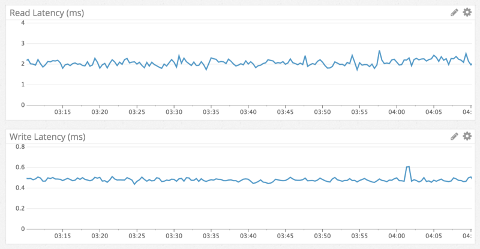

# O crescimento do Discord e o desafio de armazenar trilhões de mensagens

O Discord é uma plataforma de comunicação largamente utilizada nos dias de hoje. Foi lançado em maio de 2015 e rapidamente conquistou o gosto do público. Em 2016, a plataforma, extraordinariamente, já registrava uma base ativa mensal de 10 milhões de usuários.

Pouco tempo depois, em 2017, grandes updates foram feitos, trazendo chamadas por vídeo e compartilhamento de tela, por exemplo. Já em 2018, a base mensal de usuários havia crescido mais de 4,5 vezes, alcançando 45 milhões de usuários ativos por mês.  
Fonte: [Business of Apps](https://www.businessofapps.com/data/discord-statistics/)

---

O crescimento fora do comum da plataforma se deve principalmente a dois fatores:

1. O público gamer
2. A pandemia global da COVID-19

Diversas parcerias entre o Discord e empresas do universo gamer foram feitas ao longo dos anos. Em 2017, por exemplo, foram desenvolvidas integrações com o Xbox e a Twitch, que, apesar de não ser puramente destinada ao público em questão, é grandemente consumida e produzida pelos gamers.

Em adição a isto, em 2020, durante a pandemia, o Discord registrou incríveis 800 mil downloads por dia, o que levou, em 2021, a uma base mensal de aproximadamente 150 milhões de usuários.  
Fontes:

- [Notta](<https://www.notta.ai/en/blog/discord-statistics#:~:text=about%20this%20platform.-,Discord%20stats%20(top%20picks),user%20base%20in%20September%202021>)
- [Business of Apps](https://www.businessofapps.com/data/discord-statistics/)

---

Dado o crescimento tão expressivo, também veio um aumento ainda mais significativo no número de mensagens trocadas todos os dias.

- Julho de 2016: 40 milhões de mensagens trocadas por dia
- Dezembro de 2016: 100 milhões de mensagens trocadas por dia

Fonte: [Discord Blog – How Discord Stores Billions of Messages](https://discord.com/blog/how-discord-stores-billions-of-messages)

---

Um ponto crucial para entender o desafio de escalar esse sistema é a decisão técnica da equipe de que as mensagens nunca deveriam expirar. Desde os primeiros anos da plataforma, o Discord adotou como premissa que os usuários deveriam ter acesso a todo o histórico de mensagens, independentemente do tempo. Isso significa que nenhuma mensagem é descartada ou apagada automaticamente, e que a quantidade total de dados armazenados cresce continuamente à medida que mais mensagens são enviadas.

Tendo um crescimento tão expressivo, não demorou muito para que os executivos do Discord percebessem um grande tsunami se aproximando: como armazenar tantas mensagens trocadas a todo tempo por uma base de usuários tão grande e que cresce mais grandemente ainda?

Felizmente, esta é uma pergunta com respostas — e boas respostas!

Em 2017, Stanislav Vishnevskiy, atual CTO e cofundador do Discord, escreveu com boa profundidade sobre como eles, na época, armazenavam bilhões de mensagens, no artigo “How Discord Stores Billions of Messages”. Neste artigo, é detalhado como e por que migraram do MongoDB para uma alternativa mais confiável (segundo eles), o Cassandra.  
Fontes:

- [Discord Blog – How Discord Stores Billions of Messages](https://discord.com/blog/how-discord-stores-billions-of-messages)
- [Perfil de Stanislav Vishnevskiy](https://www.linkedin.com/in/svishnevskiy/)

Como mencionado anteriormente, em 2017, apesar de já ser uma plataforma bem reconhecida no mercado e com uma grande quantidade de usuários ativos, o Discord ainda não havia passado pelo seu maior boom de crescimento — que ocorreu durante a pandemia.

Em 2023, com uma base de 200 milhões de usuários ativos por mês, Bo Ingram, engenheiro de software do Discord, escreveu um artigo descrevendo como, agora, estavam armazenando trilhões de mensagens.  
Fontes:

- [Discord Blog – How Discord Stores Trillions of Messages](https://discord.com/blog/how-discord-stores-trillions-of-messages)
- [Perfil de Bo Ingram](https://www.linkedin.com/in/bo-ingram-1a069275/)

---

## Objetivos

Este projeto se propõe a entender e explicar como o Discord armazena quantidades massivas de mensagens.

O objetivo não é apenas explicar o sistema de armazenamento de dados do Discord atualmente, mas compreender, dada cada fase do crescimento da plataforma:

- quais eram os desafios e as necessidades,
- como a equipe foi moldando o sistema para atender tais requisitos.

Ou seja, a ideia é entender as motivações de cada atualização do sistema de armazenamento e também explicar cada tomada de decisão.

Por exemplo, na seção de introdução, foi dito que, no começo, a equipe do Discord utilizava o MongoDB para o armazenamento das mensagens. Este projeto se propõe a:

- explicar as motivações da equipe para, em 2015, terem optado pelo MongoDB,
- mostrar o que os levou a atualizar o sistema para utilizar o Cassandra, e
- compreender o que os levou a atualizar o sistema mais uma vez em 2023.

Os títulos dos artigos ressaltam e engrandecem a ordem de grandeza da quantidade de mensagens armazenadas: “bilhões” e “trilhões”.

Além da pura quantidade de mensagens armazenadas, existem outros fatores que motivaram essas atualizações?

Este projeto tem como objetivo entender esse questionamento.

## 4. Migração para o Cassandra (2017)

Em julho de 2016, foi anunciado que o discord armazenava 40 milhões de mensagens por dia. Em dezembro desse mesmo ano, o número mais que dobrou: 100 milhões. Segundo o artigo 'How Discord Stores Billions of Messages', eles tomaram a decisão de projeto inicial de nunca apagar mensagens e chats, o que gera um enorme volume de dados. Como eles fazem isso? Cassandra!

A escolha inicial pelo MongoDB se dá, indiscutivelmente segundo eles, pois esse ele permite escala de maneira rápida **(pq? isso talvez seja em outra seção)**. Tudo foi guardado em um único replica set e isso foi intencional, tudo foi planejado para uma futura migração, pois eles também sabiam que não iam continuar com o mongo porque o sharding é complicado e não tem reputação muito boa em questões de estabilidade **(pq?)**. Parte da filosofia da empresa: construir rápido para provar o conceito de um MVP, mas já deixar o caminho aberto para melhoria.

As mensagens eram armazenadas em uma coleção do Mongo com um único índice composto nos atributos channel_id e created_at. Essa escolha de índice se dá pelo seguinte principal motivo:

- Uma conversa pertence à um canal (um grupo - normalmente chamado de servidor - ou um chat entre dois usuários, como na imagem abaixo) e elas possuem uma ordem de tempo nas imagens enviadas. Logo, para buscar as imagens rapidamente e de maneira ordenada, faz muito sentido criar um índice nesses campos. Como a seletividade das mensagens sempre será baixa (já que se uma conversa tiver 1 milhão de mensagens, ainda assim é somente 10% da quantidade de mensagens trocadas POR DIA em 2017), fazendo com que o índice sempre seja acessado.


Por volta de novembro de 2015, o discord alcançou a marca de 100 milhões de mensagens armazenadas e foi nesse momento que eles perceberam os problemas esperados acontecendo: os dados e os índices já não cabiam mais na memória principal e as latências se tornaram imprevisiveís **(pq? nao podia escalar horizontalmente? - segundo eles o sharding do mongo é ruim)**.

### Padrões de Leitura/Escrita e problemas com a arquitetura atual

- Os reads eram extremamente aleatórios e a proporção de reads/writes era por volta de 50/50.

- Servidores discord focados principalmente em chat por voz eram um problema, já que pouquissimas mensagens eram trocadas e isso causava um problema conhecido: as poucas mensagens podem estar muito distantes fisicamente no disco, fazendo com sejam feitas muitas leituras aleatórias, o que é um dos principais gargalos de sistemas computacionais, já que é uma operação extremamente cara. Além disso, isso causa o que é conhecido como 'disk cache evictions':

  - É o processo de remoção de dados do cache de disco (uma área rápida de memória) para dar lugar a novos dados. O problema ocorre quando dados raramente acessados (como mensagens antigas em chats inativos, ou mesmo as mensagens desses servidores onde os canais de chat são pouco utilizados) são lidos do disco e forçam a remoção de dados "quentes" (frequentemente acessados) do cache. Quando esses dados "quentes" são necessários novamente, eles precisam ser lidos do disco, que é uma operação lenta, causando degradação na performance e latências imprevisíveis.

- Servidores médios que são mais focados em chat de mensagens não possuem esse problema em especifíco, mas acaba sendo similar uma vez que possuem poucos usuários, então as mensagens usualmente não estão em cache, sendo necessário acesso ao disco.

- Servidores grandes mandam muitas mensagens. Possuem milhares de usuários mandando milhares de mensagens. Eles fazem requests de mensagens recentes praticamente o tempo todo, então a chance da mensagem procurada estar em cache é alta.

- As features encaminhadas iriam implicar em ainda mais acessos aleatórios ao disco, como por exemplo a possibilidade de ver suas menções (@eu) nos últimos 30 dias.

### Requisitos definidos

- Escalabilidade linear: Não queriam reconsiderar a solução ou precisar fazer 're-shard' dos dados

- Recuperação automática: o Discord deveria se auto-recuperar o máximo possível

- Baixa manutenção: Deve funcionar depois da configuração. A única manutenção a ser realizada deve ser a de adicionar novos nós conforme os dados crescem.

- Tecnologia já consolidada.

- Performance previsível: Internamente, 95% de todas as requisições tem obrigatóriamente que serem feitas abaixo de 80 milisegundos. Se esse tempo for ultrapassado, então alertas serão enviados para a equipe de engenharia averiguar. Além disso, eles não querem 'cachear' mensagens em um sistema como o Redis e o Memchaced. **(pq?)**

- Não é uma 'blob-store': **(definir o que é um blob)**. Ter que lidar com os processos envolvidos com blobs seria muito custoso.

- Open source: Eles não queriam depender de uma outra empresa para algo tão essêncial no negócio deles.

O Cassandra preenche todos os requisitos:

- Para escalar, basta adicionar nós.

- Pode tolerar perda de nós sem impacto nenhum na aplicação.

- Empresas como a Netflix e Apple possuem milhares de nós Cassandra.

- Dados relacionados são mantidos continuamente no disco, proporcionando o minimo de seeks e fácil distribuição no cluster (precisa explicar melhor esse ponto, acho que é o principal e tem a ver com a principal caracteristica do Cassandra - ser oritentado a colunas)

- É open source.

### Modelagem dos dados

Segundo o artigo (billions), a melhor maneira de descrever o Cassandra é como uma 'KKV store' - **K**ey-**K**ey-**V**alue. Imagine que temos um arquivo físico com diversas pastas e que cada pasta contém fichas ordenadas.

O primeiro K é a chave de partição que o Cassandra usa para decidir em qual servidor (nó) o dado vai ser armazenado. Ela também determina a localização física do dado no disco do servidor. Na nossa analogia, esse K seria equivalente à etiqueta na frente da pasta, então teríamos pastas do tipo: 'Canal A', 'Canal B', 'Canal C' e etc, sendo que K seria o nome do canal.

Cada partição contém múltiplas tuplas. Dentro de cada partição definida pela chave de partição, é possível ter diversos registros de dados. Na analogia, é como se na pasta 'Canal A', tivessemos várias fichas de papel, sendo que cada ficha representa uma mensagem.

Cada tupla dentro da partição é identificada pelo segundo K, que é a chave de agrupamento. Além de ser o identificador único de cada tupla, ele também é responsável pela ordem que as linhas serão armazenadas no disco. Na analogia, seria como a data e hora de uma mensagem (para esta analogia, suponha que as mensagens não podem ser enviadas exatamente no mesmo momento, algo que é possível no discord). As fichas não estariam simplesmente jogadas na pasta, elas seriam organizadas por data e hora, sendo que cada data/hora identifica unicamente uma mensagem.

[Documentação do Cassandra sobre modelagem de dados](https://cassandra.apache.org/doc/latest/cassandra/developing/data-modeling/intro.html)

### Aplicando a Modelagem de Dados no Discord

Com o modelo KKV em mente, a equipe do Discord aplicou esses conceitos diretamente para resolver seus problemas de performance. A estratégia foi mapear o padrão de acesso mais comum — carregar as mensagens de um canal específico — para a estrutura de chaves do Cassandra.

A chave primária da tabela de mensagens foi definida como (channel_id, message_id):

1.  channel_id como Chave de Partição: Assim como no MongoDB o índice era em channel_id e created_at, a channel_id foi a escolha natural para a chave de partição. Isso garante que todas as mensagens de um mesmo canal sejam armazenadas juntas no mesmo nó, otimizando a busca inicial.

2.  message_id como Chave de Agrupamento: Inicialmente, created_at (data de criação) parecia uma boa candidata para a chave de agrupamento, pois as mensagens são exibidas em ordem cronológica. No entanto, duas mensagens podem ser criadas no mesmo instante, o que violaria a unicidade da chave. A solução foi usar o message_id. Cada ID no Discord é um Snowflake, um tipo de identificador que, além de ser único, é cronologicamente ordenável. Isso permitiu que o message_id servisse perfeitamente como a chave de agrupamento, garantindo unicidade e ordem.

Com essa estrutura, ao carregar um canal, o Discord pode pedir ao Cassandra um "range scan" (leitura de intervalo) exato, tornando a busca de mensagens extremamente rápida e previsível.

O esquema simplificado da tabela de mensagens ficou assim:

```sql
CREATE TABLE messages (
  channel_id bigint,
  message_id bigint,
  author_id bigint,
  content text,
  PRIMARY KEY (channel_id, message_id)
) WITH CLUSTERING ORDER BY (message_id DESC);
```

A cláusula WITH CLUSTERING ORDER BY (message_id DESC) instrui o Cassandra a armazenar as mensagens em ordem decrescente de message_id dentro de cada partição. Isso é uma otimização extra: como os usuários quase sempre querem ver as mensagens mais recentes primeiro, o banco de dados já as armazena na ordem exata em que serão exibidas, tornando a leitura ainda mais eficiente.

### O Problema das Partições Gigantes e a Solução com "Bucketing"

Durante a migração dos dados do MongoDB, a equipe do Discord encontrou um problema: alguns canais eram tão ativos que suas partições no Cassandra estavam ultrapassando o [limite recomendado de 100MB](https://cassandra.apache.org/doc/latest/cassandra/developing/data-modeling/intro.html#data-model-analysis).

Segundo o artigo do Discord, as razões de partições grandes serem um problema são operacionais e afetam a performance e estabilidade do banco de dados:

- **Pressão na Memória (GC):** Operações em partições muito grandes consomem uma quantidade significativa de memória RAM no servidor, podendo levar a longas pausas para "coleta de lixo" (Garbage Collection).
  - O cassandra é escrito em Java, por isso existe essa pressão na JVM. [repositório oficial do cassandra](https://github.com/apache/cassandra)
- **Latência de Leitura/Escrita:** O banco de dados precisa trabalhar mais para ler e manter a consistência de dados espalhados em uma partição enorme.
- **Manutenção Lenta:** Processos internos do Cassandra, como compactação, tornam-se extremamente lentos e custosos quando precisam operar em partições gigantes.
  - Processo de compactação: Para entender esse processo, é importante entender como o Cassandra armazena fisicamente seus dados. Eles são escritos em arquivos chamados de SSTables. Para que o write do Cassandra seja extremamente rápido, eles não escrevem diretamente nesse arquivo, ao invés disso, os dados são primeiramente escritos de maneira ordenada em uma estrutura em memória principal chamada memtable até que um limite configurável seja atingido. Então essa memtable passa por um processo de 'flushing' para escrever os dados no arquivo SSTable. Para manter essas SSTables, a cada inserção/update, o Cassandra escreve versões com timestamps dos novos dados em novas SSTables. Ao deletar dados, eles não são fisicamente deletados, ao invés disso são marcados como tombstones. Com o passar do tempo, acessar as tabelas podem exigir percorrer mais SSTables e para evitar isso, ocorre o processo de compactação, que é basicamente o merge das tabelas mantendo as versões mais recentes e apagando fisicamente os tombstones. [Documentação da empresa que mantém o Cassandra sobre o processo de compactação](https://docs.datastax.com/en/cassandra-oss/3.x/cassandra/dml/dmlHowDataMaintain.html#Compaction)

Para resolver isso, o Discord aplicou uma técnica de modelagem de dados comum no Cassandra chamada bucketing. A ideia é dividir artificialmente uma partição grande em várias partições físicas menores, adicionando um novo campo à chave de partição.

A chave primária foi alterada:

```sql
CREATE TABLE messages (
   channel_id bigint,
   bucket int,
   message_id bigint,
   author_id bigint,
   content text,
   PRIMARY KEY ((channel_id, bucket), message_id)
) WITH CLUSTERING ORDER BY (message_id DESC);
```

O campo `bucket` é calculado com base no tempo. No caso do Discord, eles fizeram um estudo nos maiores servidores e perceberam que guardar os últimos 10 dias de mensagens seria o ideal para manter os buckets menores que 100MB e ainda assim garantir uma performance e quantidade de dados confortável. Com isso, em vez de uma única partição gigante para um canal, agora existem várias partições menores e gerenciáveis: `(canal_123, semana_1)`, `(canal_123, semana_2)`, etc.

Isso mantém as partições pequenas, garantindo a performance e a estabilidade do cluster, com a pequena desvantagem de que a aplicação agora precisa consultar múltiplos buckets para carregar um histórico de mensagens muito antigo. Isso indica que os serividores pouco utilizados precisariam percorrer diversos buckets para coletar mensagens suficientes, mas isso é OK porque para servidores mais ativos a quantidade de mensagens suficientes é encontrada na primeira partição e esses servidores são maioria.

### Subindo para produção

Antes de colocar o novo sistema com Cassandra totalmente em produção, eles modificaram o código para fazerem os reads/writes tanto no mongo quanto no Cassandra, afim de evitar impacto aos usuários.

Logo que subiram essas mudanças eles perceberam que nos logs do sistema existiam entradas de erro dizendo que o campo obrigatório `author_id` era nulo. A culpa disso? Consistência eventual.

### Consistência eventual

O Cassandra é um banco AP (do teorema CAP), o que significa que é um banco com alta disponibilidade e alta resistência a partição.

[Documentação do Cassandra sobre suas garantias](https://cassandra.apache.org/doc/latest/cassandra/architecture/guarantees.html)

Para entender o porquê da consistência eventual ser a causa desse problema, vamos entender como a inserção dos dados no Cassandra (complementar à descrição feita acima no tópico de compactação).

O Cassandra faz um Upsert: inSERT se a tupla não existe e UPdata se ela existe. O Upsert é feito somente nas colunas, não atualizando a tupla inteira. Se o mesmo campo for atualizado concorrentemente, então a mudança com maior timestamp será mantida, implementando uma forma de "last-write-wins" por coluna.

[Artigo da empresa que mantém o Cassandra sobre a forma que o Cassandra faz o update de tuplas com "last-write-wins"](https://www.datastax.com/blog/why-cassandra-doesnt-need-vector-clocks)

Voltando ao problema do `author_id` ser nulo, imagine a seguinte situação:

- O Usuário PenidoBR está conversando em um servidor X com diversos outros usuários e envia uma mensagem ofensiva, sem perceber. O Cassandra, então, guarda a mensagem:
  ```json
  {
    message_id: 123,
    author_id: "PenidoBR",
    content: "@Dival, você é muito frango! HAHAHAHA",
    ...
  }
  ```
- Alguns minutos depois, PenidoBR percebe que a mensagem era ofensiva e vai editá-la. Porém, ao mesmo tempo, o usuário Skineura, um moderador do servidor, vê a mensagem e decide apagá-la. Ao mesmo tempo, Skineura clica o botão de apagar e PenidoBR clica o botão de editar. Ambos ainda tem acesso à mensagem.

- Por conta de latências de rede, a requisição de delete é efetuada primeiro:

  ```json
  {
    message_id: null,
    author_id: null,
    content: null,
    ...
  }
  ```

- Logo depois, a requisição de update é efetuada:

  ```json
  {
    message_id: 123,
    author_id: null,
    content: "@Dival, você precisa treinar mais! Se quiser, me chama!"
    ...
  }
  ```

  O resultado é uma mensagem corrompida: uma linha no banco que só tem channel_id, message_id e content. Todos os outros campos, como author_id, que não foram incluídos na operação de edição, ficam nulos. A mensagem "ressuscita", mas de forma incompleta.

- Exemplo em gif:

  

Eles pensaram em duas soluções para esse problema:

1. Escrever a mensagem inteira quando for editar. Isso abre margem para a "ressureição" de mensagens deletadas e aumenta a chance de conlitos em writes concorrentes em outras colunas.

2. Setando mensagens como corrompidas e deletando-as se campos obrigatórios forem nulos.

Eles escolheram a segunda abordagem e escolheram o campo author_id para ser o ponto de decisão se uma mensagem está corrompida ou não.

Ao resolverem esse problema, eles perceberam que estavam sendo ineficientes com seus writes. Como já citado anteriormente, ao deletar um registro, cria-se uma tombstone. O motivo disso é principalmente para manter a consistência individual, já que um registro deletado pode ressucitar no seguinte cenário (Cada [A] significa o dado A em um certo nó []):

- Situação inicial: [A][A][A]
- Delete A é enviado ao primeiro nó e propagado aos demais: [] -> [] -/ [A]. O último nó ainda não recebeu o delete por conta de qualquer problema de comunicação entre eles.
- Dessa forma, em uma eventual sincronização do sistema, o dado A pode ressucitar para os outros nós se o dado A for atualizado e seu timestamp for maior que o do delete, de forma semelhante ao que foi descrito no caso do Discord.

Se marcarmos com a tombstone, é fácil evitar esse comportamento:

- Situação inicial: [A][A][A]
- Delete A é enviado ao primeiro nó e propagado aos demais: [tombstone(A)] -> [tombstone(A)] -/ [A]. O último nó ainda não recebeu o delete por conta de qualquer problema de comunicação entre eles.
- Dessa forma, em uma eventual sincronização do sistema, o dado A não pode ressucitar pois já foi marcado como 'morto' em outros nós, independente de sua última atualização.

O sistema, ao ler tombstones, apenas "pula" elas. Elas vivem por 10 dias por default e são permanentemente deletadas no processo de compressão.

[Documentação sobre tombstones](https://cassandra.apache.org/doc/5.0/cassandra/managing/operating/compaction/overview.html#tombstones)

Deletar ou setar como nulo são essecialmente a mesma coisa. [Este artigo mostra, na prática, como setar uma coluna como null cria uma tombstone nessa coluna](https://digitalis.io/post/what-are-tombstones-in-cassandra-and-why-are-there-too-many). Os engenheiros do discord perceberam que, dos 16 campos da mensagem, aproximadamente 4 eram escritos com valores não nulos de fato. Eles estavam inserindo 12 tombstones na maior parte do tempo, gerando um overhead relacionado ao gerenciamento de tombstones sem motivo nenhum. A solução utilizada foi simples: se o campo não está preenchido, não envia. Dessa maneira, somente os campos de fato enviados são escritos no banco, evitando a geração de tombstones inúteis.

### Performance obtida



Como visto nessa imagem, a performance obtida foi absurda. Os reads aconteceram em cerca de 5ms e os writes em menos de 1ms.

Anteriormente, foi dito que por conta da maneira que o Mongo armazenava as mensagens, era muito custoso buscar mensagens antigas pois seriam necessários muitos acessos aleatórios ao disco, uma vez que elas raramente estariam em cache. No gif a seguir, é mostrado como um jump-back de 1 ano de mensagens acontece de maneira extremamente rápida:


